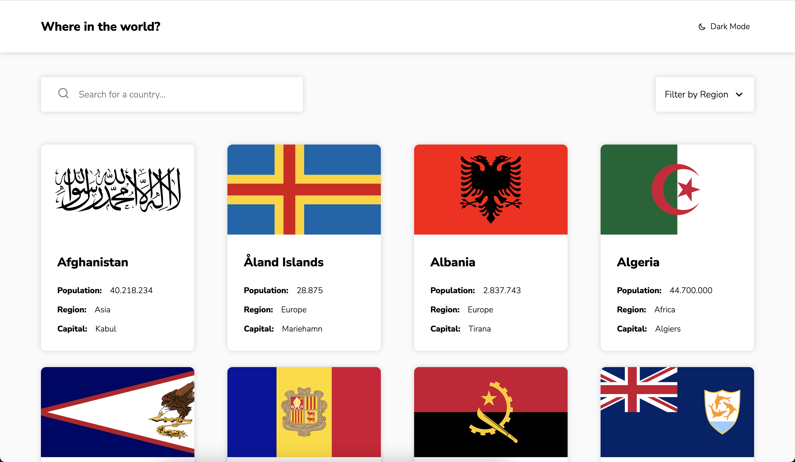

## Author

- LinkedIn - [Felipe Stefani](https://www.linkedin.com/in/felipe-stefani-a35185116/)
- Instagram - [@felipestefani](https://www.twitter.com/felipestefani)
- Frontend Mentor - [@felipestefani](https://www.frontendmentor.io/profile/felipestefani)

# Frontend Mentor - REST Countries API with color theme switcher solution

This is a solution to the [REST Countries API with color theme switcher challenge on Frontend Mentor](https://www.frontendmentor.io/challenges/rest-countries-api-with-color-theme-switcher-5cacc469fec04111f7b848ca). Frontend Mentor challenges help you improve your coding skills by building realistic projects. 

## Table of contents

- [Overview](#overview)
  - [The challenge](#the-challenge)
  - [Screenshot](#screenshot)
  - [Links](#links)
- [My process](#my-process)
  - [Built with](#built-with)
  - [Continued development](#continued-development)
- [Author](#author)

## Overview

### The challenge

Users should be able to:

- See all countries from the API on the homepage
- Search for a country using an `input` field
- Filter countries by region
- Click on a country to see more detailed information on a separate page
- Click through to the border countries on the detail page
- Toggle the color scheme between light and dark mode *(optional)*

### Screenshot

### Links

- Solution URL: [https://github.com/felipestefani/countries-api](https://github.com/felipestefani/countries-api)
- Live Site URL: [https://felipestefani.github.io/countries-api/](https://felipestefani.github.io/countries-api/)

## My process

### Built with

- Semantic HTML5 markup
- CSS custom properties
- Flexbox
- [React](https://reactjs.org/) - JS library
- [TypeScript](https://www.typescriptlang.org) - Type Script

### Continued development

I'll focus in typescript, that brings a lot of advantages to our projects.

## Author

- LinkedIn - [Felipe Stefani](https://www.linkedin.com/in/felipe-stefani-a35185116/)
- Instagram - [@felipestefani](https://www.twitter.com/felipestefani)
- Frontend Mentor - [@felipestefani](https://www.frontendmentor.io/profile/felipestefani)